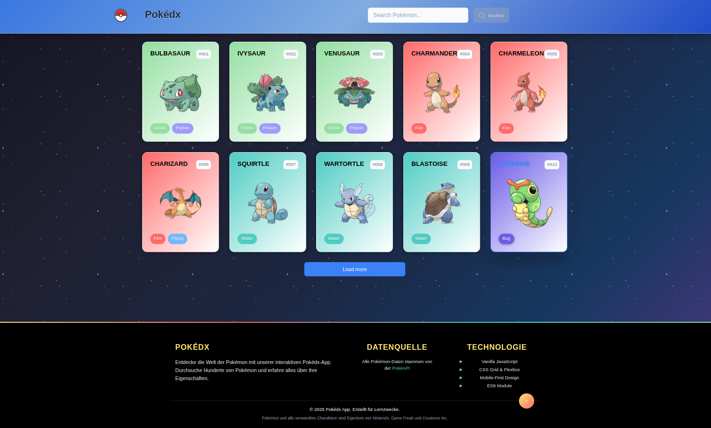

# 🎮 Pokédex Web Application

Eine moderne, responsive Pokédex-Webanwendung, die die [PokéAPI](https://pokeapi.co/) nutzt, um detaillierte Informationen über Pokémon anzuzeigen.




## 📋 Projekt-Checkliste

### ✅ 1. Git-Workflow

- [x] GitHub Repository von Anfang an genutzt
- [x] Regelmäßige Commits nach Coding-Sessions
- [x] Klare, aussagekräftige Commit-Messages (z.B. "style: Refactor API for improved readability")
- [x] `.gitignore` vorhanden und konfiguriert
- [x] Repository ist aktuell und gepflegt

### ✅ 2. Allgemeine Anforderungen

- [x] **20 Pokémon** werden initial geladen
- [x] **Lazy-Loading**: Details werden erst beim Öffnen der Detailkarte geladen
- [x] **Fetch-then-Render**: Daten werden geladen, dann gerendert
- [x] **Load More Button**: Lädt weitere 20 Pokémon
  - [x] Loading-Screen mit Spinner
  - [x] Button ist während des Ladens deaktiviert
- [x] Eigenes, kreatives Design ohne Mockup

### ✅ 3. Kleine Pokémon-Karte (Listenansicht)

- [x] **Name** (Großgeschrieben!)
- [x] **Typ/en** mit Farb-Badges
- [x] **Bild** des Pokémon (hochauflösend)
- [x] **Hintergrundfarbe** passend zum Typ
- [x] **ID** (#001, #002, etc.)
- [x] **Hover-Effekt** mit Scale-Animation

### ✅ 4. Große Ansicht (Overlay/Modal)

- [x] Öffnet beim Klick auf kleine Karte
- [x] **Transparentes Overlay** mit Backdrop-Filter
- [x] Schließt beim Klick außerhalb der Karte
- [x] Hintergrund nicht scrollbar während Modal offen
- [x] **Angezeigt werden**:
  - Name & ID
  - Typ/en
  - Hochauflösendes Bild
  - **Base Stats**: HP, Attack, Defense, Sp. Attack, Sp. Defense, Speed
  - **Physische Eigenschaften**: Größe, Gewicht
  - **Fähigkeiten** (inkl. versteckte Fähigkeiten)
- [x] **Navigation**: Pfeile zum Wechseln zwischen Pokémon

### ✅ 5. Code-Qualität

- [x] **Aussagekräftige Namen** für Funktionen und Variablen
- [x] **camelCase** konsequent verwendet
- [x] Code ist formatiert und einheitlich
- [x] **Höchstens 14 Zeilen pro Funktion** (alle Funktionen refaktoriert)
- [x] **Gleicher Abstand** zwischen Funktionen (1-2 Leerzeilen)
- [x] **HTML Templates ausgelagert** in `templates.js`

### ✅ 6. Responsive Design

- [x] **Bis 320px Breite** responsive ohne Scrollbalken
- [x] **Content-Begrenzung** für große Monitore (max-width)
- [x] **Mobile-First Ansatz** durchgängig implementiert
- [x] Breakpoints: 480px, 768px, 1024px
- [x] Touch-optimierte Bedienung

### ✅ 7. Sonstiges

- [x] **Favicon** vorhanden (pokeball.svg)
- [x] **Dokumenten-Titel**: "Pokédex - Explore the World of Pokémon"
- [x] Hauptseite heißt **index.html**
- [x] **Sprachkonsistenz**: Alles auf Englisch (API ist Englisch)
- [x] **Header** mit:
  - Logo (Pokéball)
  - Titel (Pokédex)
  - **Suchleiste** (mindestens 3 Buchstaben erforderlich)
  - Search-Button aktiviert sich erst ab 3 Zeichen

## 🚀 Features

### Kernfunktionen

- ✨ **Moderne UI** mit Glasmorphismus-Effekten
- 🔍 **Live-Suche** mit Autocomplete
- 📱 **Vollständig Responsive** (320px - 1920px+)
- ⚡ **Performance-Optimiert** mit Caching
- ♿ **Accessibility** (ARIA-Labels, Keyboard-Navigation)
- 🎨 **Typ-basierte Farbgebung**
- 🌙 **Smooth Animations** & Transitions

### Zusätzliche Features (Extras)

- 🎯 **Intelligente Suche**:
  - 3-Zeichen-Minimum-Validierung
  - Autocomplete mit Top-10-Vorschlägen
  - Suche nach Name oder ID
- 💾 **Smart Caching**: Bereits geladene Pokémon werden zwischengespeichert
- 🔄 **Fehlerbehandlung**: Globale Error-Handler mit User-Feedback
- 📊 **Detaillierte Stats**: Visualisierte Balken für alle Werte
- 🎮 **Keyboard-Navigation**: Pfeiltasten im Modal
- 🔔 **Toast-Notifications**: Benutzer-Feedback bei Aktionen

## 🛠️ Technologie-Stack

```
Frontend:
├── Vanilla JavaScript (ES6+)
├── CSS3 (Grid, Flexbox, Custom Properties)
├── HTML5 Semantic Markup
└── Module-basierte Architektur

API:
└── PokéAPI v2 (REST)

Tools:
├── Git & GitHub
└── VS Code
```

## 📁 Projektstruktur

```
Pokedex/
├── assets/
│   └── icons/          # SVG Icons (Pokéball, Search, etc.)
├── scripts/
│   ├── main.js         # App Entry Point
│   ├── api.js          # PokéAPI Integration
│   ├── templates.js    # HTML Template Functions
│   ├── search.js       # Search & Autocomplete
│   ├── pokemon-list.js # Card Rendering
│   ├── pokemon-detail.js # Modal Logic
│   ├── ui-helpers.js   # UI Utility Functions
│   └── constants.js    # Configuration & Constants
├── styles/
│   ├── global.css      # Global Styles & Variables
│   ├── layout.css      # Layout System
│   ├── components/     # Component-Specific Styles
│   │   ├── header.css
│   │   ├── pokemon-card.css
│   │   ├── modal.css
│   │   ├── search.css
│   │   ├── buttons.css
│   │   └── loading.css
│   └── utilities/      # Utility Styles
│       ├── responsive.css
│       └── animations.css
├── index.html          # Main HTML File
├── .gitignore
└── README.md
```

## 🎯 Code-Architektur

### Modulare JavaScript-Struktur

```javascript
// Alle Funktionen sind maximal 14 Zeilen lang
// Beispiel aus api.js:

export let fetchPokemonList = async (offset, limit) => {
  const url = `${API_CONFIG.baseUrl}${API_CONFIG.endpoints.pokemon}?offset=${offset}&limit=${limit}`;
  const response = await fetch(url);
  if (!response.ok) throw new Error(`API Error: ${response.status}`);

  const data = await response.json();
  appState.currentOffset = offset;

  const pokemonDetails = await fetchPokemonDetails(data.results);
  appState.pokemonList.push(...pokemonDetails);

  console.log("📊 API data processed:", data.results.length, "Pokémon");
  return pokemonDetails;
};
```

### Template-System

Alle HTML-Templates sind in separate Funktionen ausgelagert:

```javascript
// templates.js
export function createPokemonCardHTML(pokemon) { ... }
export function createModalHTML(pokemon) { ... }
export function createStatsHTML(stats) { ... }
```

## 📱 Responsive Breakpoints

```css
/* Mobile First Approach */
/* Base: 320px - 479px */

@media (min-width: 480px) {
  /* Small Tablets */
}
@media (min-width: 768px) {
  /* Tablets */
}
@media (min-width: 1024px) {
  /* Desktop */
}
@media (min-width: 1440px) {
  /* Large Desktop */
}
```

## 🎨 Design-Prinzipien

- **Mobile-First**: Optimiert für kleine Bildschirme zuerst
- **Accessibility**: WCAG 2.1 AA konform
- **Performance**: Lazy Loading, Caching, optimierte Bilder
- **UX**: Klare Feedback-Mechanismen, intuitive Navigation
- **Clean Code**: Max 14 Zeilen pro Funktion, klare Namensgebung

## 🚦 Installation & Start

```bash
# Repository klonen
git clone https://github.com/rockviktor78/Pokedex.git

# In das Verzeichnis wechseln
cd Pokedex

# Mit einem lokalen Server starten (z.B. Live Server in VS Code)
# Oder Python SimpleHTTPServer:
python3 -m http.server 8000

# Im Browser öffnen
# http://localhost:8000
```

## 🔍 Verwendung

1. **Pokémon durchsuchen**: Scrollen Sie durch die Liste oder nutzen Sie die Suchfunktion
2. **Suche**: Mindestens 3 Zeichen eingeben für Autocomplete
3. **Details ansehen**: Klicken Sie auf eine Pokémon-Karte
4. **Navigation im Modal**: Verwenden Sie die Pfeile oder Tastatur (← →)
5. **Mehr laden**: Klicken Sie auf "Load More Pokémon"

## 📊 Performance-Optimierungen

- ✅ **API-Caching**: Verhindert redundante Netzwerk-Requests
- ✅ **Lazy Loading**: Details werden erst bei Bedarf geladen
- ✅ **Debouncing**: Suchfunktion verzögert API-Calls
- ✅ **Image Optimization**: Hochauflösende Bilder von offizieller Quelle

## 🐛 Bekannte Limitierungen

- PokéAPI Rate Limit: Max. 100 Requests pro Minute
- Keine Offline-Funktionalität (PWA könnte implementiert werden)

## 🔮 Mögliche Erweiterungen

- [ ] Favoriten-System mit LocalStorage
- [ ] Filterfunktion nach Typ, Generation
- [ ] Vergleichsfunktion für Pokémon
- [ ] Dark Mode Toggle
- [ ] Progressive Web App (PWA)
- [ ] Mehrsprachigkeit

## 👨‍💻 Entwickler

**Viktor Wilhelm**

- GitHub: [@rockviktor78](https://github.com/rockviktor78)

## 📝 Lizenz

Dieses Projekt wurde für Lernzwecke erstellt. Pokémon und alle verwandten Charaktere sind Eigentum von Nintendo, Game Freak und Creatures Inc.

## 🙏 Danksagungen

- **PokéAPI**: Für die umfassende und kostenlose API
- **Nintendo/Game Freak**: Für das Pokémon-Franchise
- Alle Entwickler, die zur Open-Source-Community beitragen

---

**⭐ Wenn dir dieses Projekt gefällt, gib ihm einen Stern auf GitHub!**
